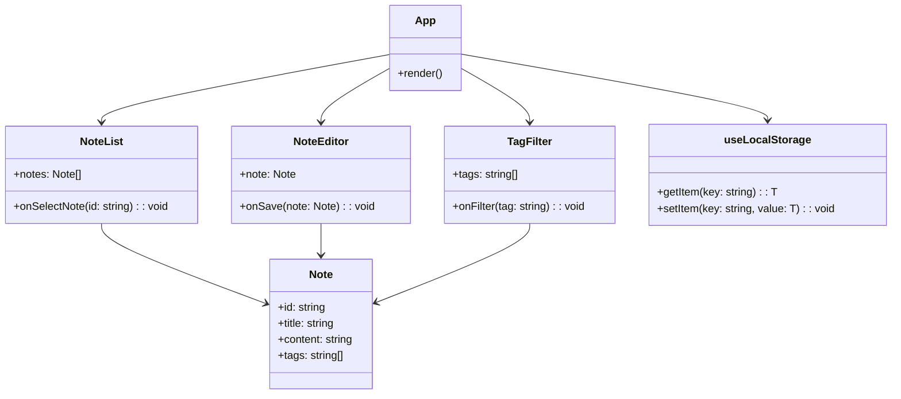

# Markdown Note

Markdown Note 是一个使用 React 和 TypeScript 构建的轻量级笔记应用程序，支持 Markdown 格式。它允许用户创建、编辑和删除笔记，并为笔记添加标签以进行分类和筛选。

## 功能特性
- **创建笔记**：用户可以轻松创建新的笔记，输入标题和 Markdown 格式的内容。
- **编辑笔记**：支持对已有的笔记进行编辑，修改标题、内容和标签。
- **删除笔记**：用户可以删除不再需要的笔记。
- **标签管理**：为笔记添加标签，方便分类和筛选。用户可以创建、编辑和删除标签。
- **笔记筛选**：通过标题和标签对笔记进行筛选，快速找到所需的笔记。

## 技术栈
- **前端框架**：React
- **状态管理**：使用 `useLocalStorage` 钩子将数据存储在本地存储中。
- **样式框架**：Bootstrap
- **路由管理**：React Router DOM
- **Markdown 解析**：React Markdown
- **类型检查**：TypeScript
- **构建工具**：Vite

## 项目结构
```
markdown-note/
├── src/
│   ├── components/
│   │   ├── EditNote.tsx
│   │   ├── EditTagsModal.tsx
│   │   ├── NewNote.tsx
│   │   ├── Note.tsx
│   │   ├── NoteCard.tsx
│   │   ├── NoteForm.tsx
│   │   ├── NoteLayout.tsx
│   │   └── NoteList.tsx
│   ├── hooks/
│   │   ├── useLocalStorage.ts
│   │   └── useNote.ts
│   ├── App.tsx
│   └── main.tsx
├── .gitignore
├── eslint.config.js
├── index.html
├── package.json
├── pnpm-lock.yaml
├── tsconfig.app.json
├── tsconfig.node.json
├── tsconfig.json
└── vite.config.ts
```

## 安装与运行
1. **克隆仓库**
```bash
git clone https://github.com/jet-isnt-haha/markdown-note.git
cd markdown-note
```
2. **安装依赖**
```bash
pnpm install
```
3. **启动开发服务器**
```bash
pnpm dev
```
4. **打开浏览器**
访问 `http://localhost:5173` 即可看到应用程序。

## 构建项目
```bash
pnpm build
```
构建后的文件将生成在 `dist` 目录下。

## 代码规范
项目使用 ESLint 进行代码检查，确保代码质量和一致性。可以运行以下命令进行代码检查：
```bash
pnpm lint
```


## 类图说明

- **App**：主应用组件，负责组织和渲染其他子组件。
- **NoteList**：显示笔记列表，允许用户选择特定笔记进行查看或编辑。
- **NoteEditor**：用于编辑笔记内容，包括标题、正文和标签。
- **TagFilter**：提供标签过滤功能，帮助用户按标签筛选笔记。
- **useLocalStorage**：自定义 Hook，用于将笔记数据存储在浏览器的本地存储中。
- **Note**：定义笔记的数据结构，包括 ID、标题、内容和标签。



## 许可证
本项目采用 [MIT 许可证](LICENSE)。
